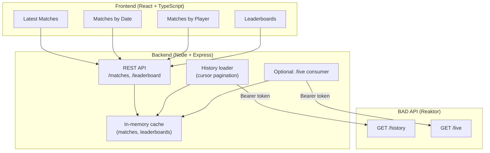

# Reaktor RPS League — Architecture & Implementation Guide

This document answers key design questions and provides a step-by-step plan to build the application.

---

## 1. Do We Need a Backend?

**Yes. A backend is required.**

| Reason | Explanation |
|--------|-------------|
| **No server-side filtering** | The BAD API does not support `?date=`, `?player=`, or similar filters. You get paginated history only. |
| **Cursor-based pagination** | You must follow cursors sequentially (page 1 → 2 → 3). You cannot “jump” to a specific date or player on the API. |
| **Data volume** | “Thousands of matches every day” implies large history. Fetching and filtering everything in the browser is impractical and slow. |
| **Token security** | The Bearer token must not be exposed in frontend code. The backend holds the token and calls the API. |
| **Aggregation** | Leaderboards (today’s wins, historical wins in a date range) require aggregating many matches. Doing this in a backend is cleaner and more efficient. |

**Conclusion:** Use a small backend to consume the API, optionally cache/aggregate data, and expose clean REST (or similar) endpoints for the frontend.

---

## 2. Recommended Technologies & Libraries

### Frontend
| Choice | Purpose |
|--------|---------|
| **React 18** | UI framework (aligns with Reaktor’s stack). |
| **TypeScript** | Type safety and better DX. |
| **Vite** | Fast dev server and build. |
| **React Router** | Routes for: latest matches, by date, by player, today’s leaderboard, historical leaderboard. |
| **Fetch / TanStack Query (React Query)** | Data fetching, caching, and loading/error states. |
| **CSS** | Tailwind CSS or plain CSS modules — keep UI clear and readable. |

### Backend
| Choice | Purpose |
|--------|---------|
| **Node.js + Express** (or **Fastify**) | Simple HTTP API. |
| **TypeScript** | Same language as frontend, shared types possible. |
| **Server-Sent Events (SSE)** | Consume `/live` in the backend and optionally forward to frontend or use to update cache. |
| **In-memory cache** | Store normalized matches and precomputed leaderboards (see Section 3). |

### Alternative: Full-Stack in One Repo
- **Next.js** (App Router or Pages): frontend + API routes in one app.
- API routes act as the backend: call BAD API, cache in memory, expose `/api/matches`, `/api/leaderboard`, etc.
- Single deployment (e.g. Vercel).

### Libraries to Consider
- **Frontend:** `date-fns` or `dayjs` for date handling; optional table/virtualization for long lists.
- **Backend:** `node-fetch` or native `fetch`; `eventsource` or native `EventSource` for consuming `/live`.
- **Shared:** A shared folder or package for types (e.g. `Match`, `Player`, `LeaderboardEntry`).

---

## 3. Backend: Caching vs Database

**Recommendation: start with in-memory caching; add a DB only if you want persistence or have extra time.**

### Option A: In-memory cache (recommended for the assignment)

| Pros | Cons |
|------|------|
| No DB setup or hosting | Data lost on restart (re-fetch on startup) |
| Fast to implement | Not suitable for very large history unless you cap size |
| Good for demo and interview | No persistence across deploys |
| Easy to reason about | |

**How to use it:**
- On startup (or on first request): follow `/history` cursors and fetch pages until you have enough data (e.g. last N days or N matches).
- Normalize each game (player names, moves, winner, timestamp) and store in memory (e.g. `Map<date, Match[]>` and/or `Map<playerId, Match[]>`).
- Precompute or compute on demand: “today’s leaderboard”, “historical leaderboard for date range”.
- Optionally: run a background job that consumes `/live` and appends new matches to the cache and updates leaderboards.
- Expose endpoints such as: `GET /matches?date=YYYY-MM-DD`, `GET /matches?player=id`, `GET /matches/latest`, `GET /leaderboard/today`, `GET /leaderboard?from=&to=`.

### Option B: Database (e.g. SQLite or Postgres)

| Pros | Cons |
|------|------|
| Persistent across restarts | More setup and deployment complexity |
| Can store full history and query by date/player | May be unnecessary for assignment scope |
| Scales better for “production-like” solution | |

**Suggestion:** Implement with **caching first**. In the submission and interview, you can say: “With more time I would add a database for persistence and to handle full history.”

---

## 4. Features to Build (Checklist)

Prioritize to showcase skills and meet the brief. Suggested order:

| # | Feature | Description | Priority |
|---|---------|-------------|----------|
| 1 | **Latest match results** | List most recent matches (from cache or last page of history). | Must |
| 2 | **Match results on a given day** | Filter matches by selected date (e.g. date picker). | Must |
| 3 | **Match results for a specific player** | Search/select player; show all their matches. | Must |
| 4 | **Today’s leaderboard** | Rank players by number of wins today. | Must |
| 5 | **Historical leaderboard** | Date range picker; rank by wins in that range. | Must |
| 6 | **Live updates** | Optional: use `/live` to update “latest” and leaderboards in real time. | Nice to have |

**Game logic (backend or shared):**
- Implement RPS rules to determine winner per match.
- Treat same move as draw.
- Handle unexpected move values (e.g. “dog”) as invalid/unknown and skip or mark accordingly.

---

## 5. High-Level System Architecture

```
┌─────────────────────────────────────────────────────────────────────────┐
│                              FRONTEND (React + TS)                        │
│  ┌──────────────┐ ┌──────────────┐ ┌──────────────┐ ┌──────────────────┐ │
│  │ Latest       │ │ By Date      │ │ By Player    │ │ Leaderboards     │ │
│  │ Matches      │ │ Matches      │ │ Matches      │ │ Today / History  │ │
│  └──────┬───────┘ └──────┬───────┘ └──────┬───────┘ └────────┬─────────┘ │
│         │                │                │                   │          │
│         └────────────────┴────────────────┴───────────────────┘          │
│                                    │                                       │
│                          HTTP (fetch / React Query)                        │
└────────────────────────────────────┼──────────────────────────────────────┘
                                     │
                                     ▼
┌─────────────────────────────────────────────────────────────────────────┐
│                         YOUR BACKEND (Node + Express)                    │
│  ┌──────────────────────────────────────────────────────────────────┐  │
│  │  REST API                                                          │  │
│  │  GET /matches/latest   GET /matches?date=...   GET /matches?player= │  │
│  │  GET /leaderboard/today   GET /leaderboard?from=...&to=...         │  │
│  └──────────────────────────────────────────────────────────────────┘  │
│                                    │                                     │
│  ┌──────────────────────────────────┴────────────────────────────────┐  │
│  │  In-memory cache (matches by date/player, precomputed leaderboards)│  │
│  └──────────────────────────────────┬────────────────────────────────┘  │
│                                     │                                     │
│  Optional: background job consuming /live to append new matches         │
└─────────────────────────────────────┼───────────────────────────────────┘
                                       │
                    Bearer token       │
                                       ▼
┌─────────────────────────────────────────────────────────────────────────┐
│                    BAD API (assignments.reaktor.com)                     │
│         GET /history (paginated)          GET /live (SSE stream)          │
└─────────────────────────────────────────────────────────────────────────┘
```

---

## 6. System Diagram (Mermaid)

You can render this in GitHub, VS Code (Mermaid extension), or [mermaid.live](https://mermaid.live).



---

## 7. Data Flow (Simplified)

1. **Backend startup:** Request `GET /history` with Bearer token; follow `cursor` until enough pages (or a limit) are loaded; normalize matches, compute winners; fill in-memory structures (e.g. by date, by player); compute today’s and recent leaderboards.
2. **Optional:** Backend subscribes to `GET /live`; on each event, add match to cache and update leaderboards.
3. **Frontend:** Calls your backend only (e.g. `/matches/latest`, `/matches?date=2025-03-10`, `/leaderboard/today`). No direct calls to BAD API, no token in frontend.
4. **User actions:** Change date, select player, change date range → frontend sends new request → backend reads from cache and returns JSON.

---

## 8. Step-by-Step Implementation Plan

### Phase 1: Backend core
1. Create Node + Express (or Fastify) project with TypeScript.
2. Add env variable for `BEARER_TOKEN` (e.g. `jn6evg3xOxIOgVFshIZsPAgeFD_T65S5`).
3. Implement a client for BAD API:
   - `fetchHistoryPage(cursor?)` → GET `/history`, return `{ data, cursor }`.
   - Optionally: `subscribeLive(callback)` using SSE for `/live`.
4. Implement RPS game logic: given two moves, return winner (A, B, or draw); handle invalid moves.
5. Implement cache layer:
   - Data structures: e.g. `matchesByDate`, `matchesByPlayer`, list of “latest” matches.
   - Loader: loop over `fetchHistoryPage` until cursor is null or limit reached; normalize and store.
6. Expose endpoints:
   - `GET /matches/latest`
   - `GET /matches?date=YYYY-MM-DD`
   - `GET /matches?player=<id>`
   - `GET /leaderboard/today`
   - `GET /leaderboard?from=YYYY-MM-DD&to=YYYY-MM-DD`
7. Test with Postman or curl (and keep token out of repo).

### Phase 2: Frontend core
1. Create React + TypeScript project (e.g. Vite).
2. Add React Router: routes for latest, by date, by player, today leaderboard, historical leaderboard.
3. Define types (or import from backend/shared): `Match`, `LeaderboardEntry`, etc.
4. Use fetch + React Query (or similar) to call backend; handle loading and errors.
5. Implement pages:
   - **Latest:** table or list of latest matches.
   - **By date:** date picker + list of matches for that day.
   - **By player:** input or selector + list of matches for that player.
   - **Today’s leaderboard:** table (rank, player, wins).
   - **Historical leaderboard:** from/to date inputs + table (rank, player, wins in range).
6. Add simple navigation (e.g. navbar) and basic styling.

### Phase 3: Polish and deployment
1. Add error states and empty states (e.g. “No matches on this day”).
2. Ensure token is only in backend env (e.g. `.env` in backend, not committed).
3. **Timezone:** Use IANA timezone for "today" and date ranges; backend uses Day.js for DST-correct local-day boundaries. **CI:** GitHub Actions for backend and frontend (install, lint, format check, build).
4. Deploy backend (e.g. Railway, Render) and frontend (e.g. Vercel); set env vars.
5. Optionally: document how you’d extend (DB, more history, live updates) in README.

---

## 9. Clarifications You Might Want to Confirm

- **API base URL:** Is it `https://assignments.reaktor.com/bad-api/` or exactly `https://assignments.reaktor.com/` with paths `/history` and `/live`? (Check with a single request.)
- **Response shape:** What does one element in the history response look like? (field names for gameId, time, playerA, playerB, moves.)
- **Live event shape:** What does one SSE event from `/live` contain? (same as one history record or different?)
- **Scope of history:** Do you want to load “all” history (might be slow) or last N days / N matches for the demo?

If you want, the next step can be: **scaffolding the backend (Express + TS + one `/history` fetch and one GET endpoint)** or **defining the exact API response types** once you have a sample response from the BAD API.

---

## 10. Summary Table

| Question | Answer |
|----------|--------|
| Backend needed? | **Yes** — API has no filtering, cursor pagination, token must stay server-side. |
| Frontend | React + TypeScript + Vite; React Router; React Query (or fetch). |
| Backend | Node + Express (or Fastify) + TypeScript; or Next.js API routes. |
| Caching vs DB | **In-memory cache** for the assignment; DB as “with more time” improvement. |
| Deployment | Frontend: Vercel. Backend: Railway or Render (or single Next.js on Vercel). |

This gives you a clear path from zero to a working app that meets the brief and is easy to explain in the technical interview.

---

## 11. Verified API (from live call)

- **Base URL:** `https://assignments.reaktor.com`
- **Paths:** `GET /history`, `GET /live`
- **Auth:** `Authorization: Bearer <token>`
- **History response:** `{ data: GameResult[], cursor?: string }`. Each game has `gameId`, `time` (ms), `playerA: { name, played }`, `playerB: { name, played }`. Moves are `ROCK` | `PAPER` | `SCISSORS`.
- **Pagination:** Next page = `GET {baseURL}{cursor}` (e.g. `GET https://assignments.reaktor.com/history?cursor=XXX`).

See **`docs/API_REFERENCE.md`** for full response shape and TypeScript types.

---

## 12. Best scope to fulfill the assignment

To fulfill the assignment in a strong way without overreaching:

| Do | Why |
|----|-----|
| **Implement all 5 required features** | Latest matches, by date, by player, today’s leaderboard, historical leaderboard. That’s what they ask for. |
| **Use a backend + in-memory cache** | Keeps token safe, allows filtering/aggregation, no DB setup. |
| **Load a bounded amount of history** | e.g. Last 7–14 days or first 50–100 pages. Enough for demo and leaderboards; avoid “load everything” (could be huge). |
| **Implement RPS winner logic** | Handle R/P/S and draws; treat unknown moves as invalid/draw or skip. |
| **Keep UI clear and navigable** | Simple nav, tables/lists, date picker, player search. No need for heavy UI libs. |
| **Optional: /live** | If time allows, consume `/live` to update “latest” and today’s leaderboard in real time. Mention in README if you’d add it with more time. |

**Skip for the deadline:** Full “load all history”, database, complex animations, auth. You can describe these as “with more time I would…” in the submission form.
